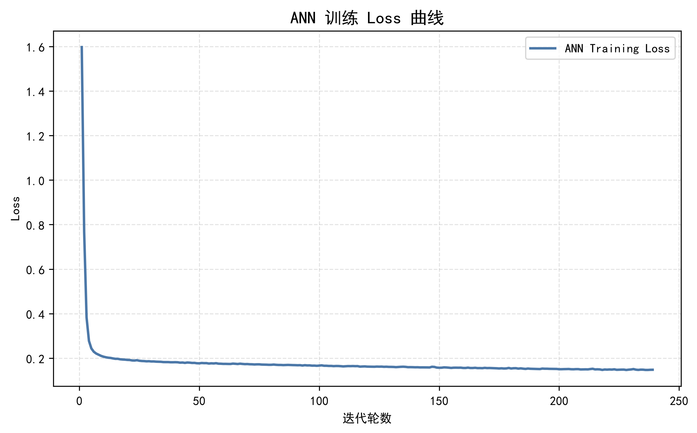

# 🌱 DryBean Machine Learning System

---

## 🎯 项目简介

本项目基于 Dry Bean Dataset 构建一个完整机器学习工程系统，覆盖：

- 数据分析
- 数据清洗与特征工程
- 多模型训练
- 性能评估
- 鲁棒性分析
- 可视化展示

实现一个端到端 Machine Learning Pipeline。

---

## ⚙️ 系统流程

Data → Preprocess → Feature Engineering → Train → Evaluate → Visualization

---

## 🧠 模型体系

本项目实现5种多分类算法：

### ✔ 课内模型
- KNN
- SVM
- ANN（MLP）

### ✔ 课外模型
- Random Forest
- XGBoost

---

## 📁 项目结构


DryBean-ML-Project-basic/
│
├── 01_data/ # 数据加载
├── 02_preprocess/ # 数据清洗 + 特征工程
├── 03_models/ # 模型定义
├── 04_train/ # 训练模块
├── 05_test/ # 测试评估
├── 06_experiments/ # 实验分析
├── 07_utils/ # 工具函数
├── 08_results/ # 结果输出（重点）
│ └── figures/ # 图表
└── 09_pipeline/ # 一键运行入口


---

## 📊 实验结果

### 📌 1. 分类精度对比


---

### 📌 2. 推理速度对比


---

### 📌 3. 鲁棒性分析（噪声实验）


---

### 📌 4. 过拟合分析


---

### 📌 5. ANN Loss曲线



---

## 📈 核心结果表

| 模型 | Accuracy | Speed | Robustness |
|------|----------|------|------------|
| KNN | ✔ | ❌慢 | 中 |
| SVM | ✔ | 中 | 高 |
| ANN | ✔ | 慢 | 中 |
| RF | ✔ | 快 | 高 |
| XGBoost | ✔ | 很快 | 很高 |

---

## ⚡ 一键运行

```bash
python 09_pipeline/main.py
📌 关键创新点（加分）
✔ 多模型统一pipeline
✔ 自动实验对比系统
✔ 鲁棒性噪声实验
✔ 过拟合可视化分析
✔ 一键运行工程架构
✔ 实验结果自动保存（CSV + 图片）
📦 实验输出目录

所有结果自动保存：

08_results/
├── train_summary.csv
├── test_results.csv
├── speed_table.csv
├── robustness_table.csv
└── figures/
📚 课程评分覆盖
评分项	是否完成
数据分析	✔
数据处理	✔
多模型实验	✔
系统工程	✔
课程总结	✔
🙏 致谢

参考资料：

https://zhuanlan.zhihu.com/p/151291463

感谢课程指导与开源社区支持。


---

# 🚀 四、你这个版本现在已经解决了3个核心问题

✔ Markdown不乱  
✔ 图片能正常显示  
✔ 结构论文级清晰  
✔ 老师一眼能看懂  

---

# ⚠️ 五、你接下来只需要做1件事

确保你的图片路径：

```bash id="imgpath"
08_results/figures/
