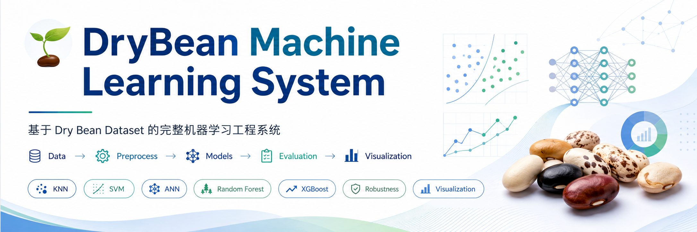
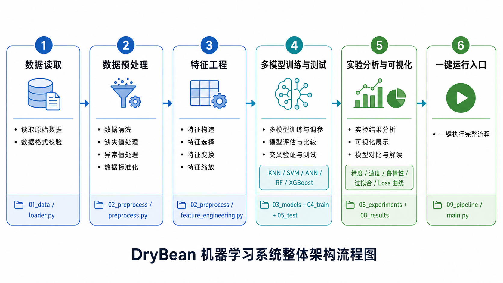
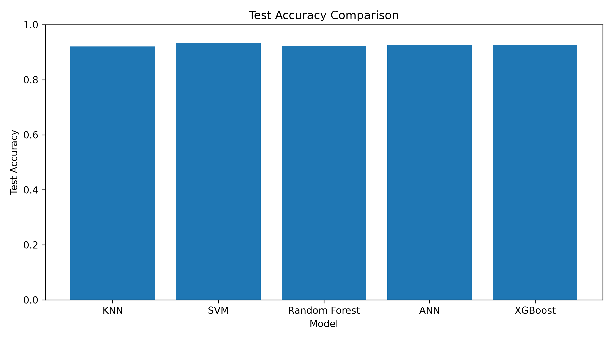
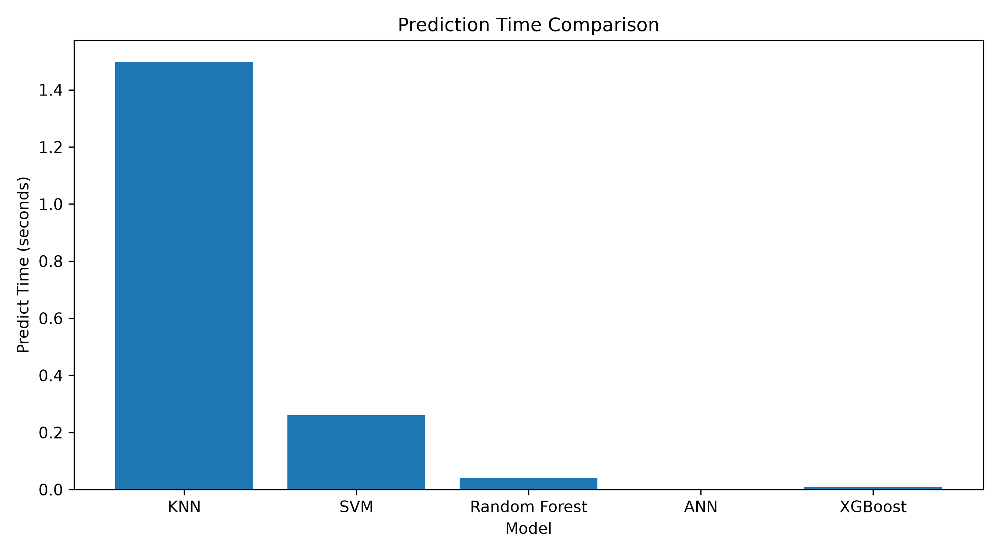
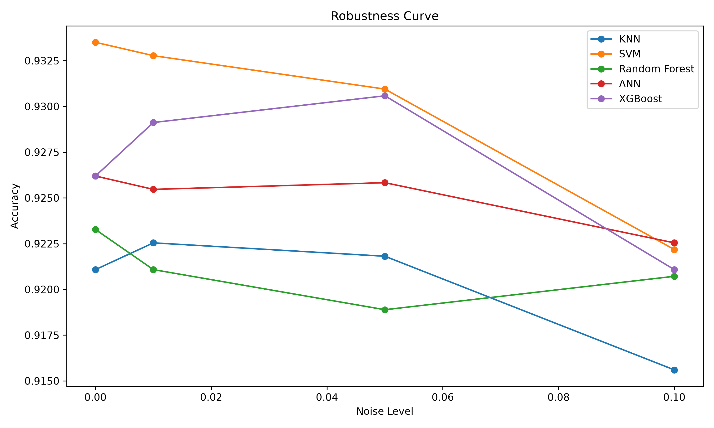
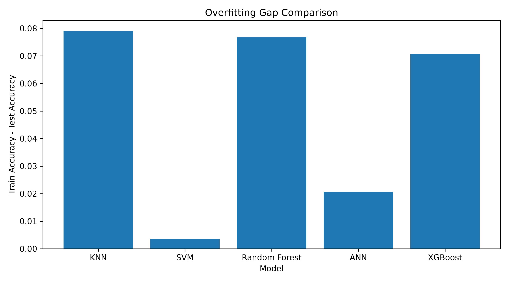

<a id="top"></a>



# 🌱 DryBean Machine Learning System


基于 **Dry Bean Dataset** 的多模型分类机器学习工程项目。项目围绕机器学习课程期末要求，完成数据分析、数据清洗、特征工程、多模型训练、实验评估、鲁棒性分析、结果可视化和 GitHub 工程展示。

> [!IMPORTANT]
> 本项目不是单一模型实验，而是一个完整的机器学习工程流程：
> **Data Analysis → Data Processing → Feature Engineering → Model Training → Evaluation → Visualization → GitHub Showcase**

---

<a id="table-of-contents"></a>

## 📑 目录

* [📌 项目概述](#project-overview)
* [🎯 项目任务与完成情况](#task-coverage)
* [🧭 系统整体流程](#pipeline)
* [📁 项目结构](#project-structure)
* [🧩 重点项目文件说明](#key-files)
* [📊 数据分析与数据处理](#data-processing)
* [🤖 模型与实验方法](#models-and-methods)
* [📈 实验结果与分析](#results)
* [🖼️ 可视化结果展示](#figures)
* [🚀 快速运行](#quick-start)
* [🧪 一键运行完整实验](#run-pipeline)
* [💻 核心代码说明](#core-code)
* [📦 输出文件说明](#outputs)
* [📝 项目总结](#summary)
* [🤝 讨论与交流](#discussion)

---

<a id="project-overview"></a>

## 📌 项目概述

本项目以 **Dry Bean Dataset** 为实验数据集，完成一个面向多分类任务的机器学习工程系统。数据集包含豆类样本的形态学特征，例如面积、周长、长轴长度、短轴长度、偏心率、紧致度、圆度以及多个形状因子等。模型任务是根据这些数值型特征预测样本所属的豆类类别。

本项目的重点不是单独调用某一个机器学习模型，而是按照完整工程流程组织实验过程，包括原始数据读取、数据质量检查、数据清洗、特征工程、模型训练、模型测试、实验对比、图表生成和 GitHub 展示。

| 项目内容 | 说明                                |
| ---- | --------------------------------- |
| 数据集  | Dry Bean Dataset                  |
| 任务类型 | 多分类任务                             |
| 特征类型 | 结构化数值特征                           |
| 类别数量 | 7 类                               |
| 实现模型 | KNN、SVM、ANN、Random Forest、XGBoost |
| 评价维度 | 准确率、推理速度、鲁棒性、过拟合情况、ANN Loss 曲线    |
| 工程特点 | 模块化目录结构，一键运行，结果自动保存               |

[⬆ 返回目录](#table-of-contents)

---

<a id="task-coverage"></a>

## 🎯 项目任务与完成情况

本项目按照机器学习课程期末作业要求设计，覆盖数据分析、数据处理、多算法实验分析、工程系统展示和课程总结等内容。

| 课程要求      | 项目实现情况                     | 对应模块                                                                           |
| --------- | -------------------------- | ------------------------------------------------------------------------------ |
| 数据分析      | 统计数据规模、字段结构、缺失值、重复值、标签污染情况 | [`01_data/loader.py`](01_data/loader.py)                                       |
| 数据处理      | 完成缺失值处理、重复值删除、标签规范化、标准化处理  | [`02_preprocess/preprocess.py`](02_preprocess/preprocess.py)                   |
| 特征工程      | 生成特征统计、相关性矩阵和高相关特征分析结果     | [`02_preprocess/feature_engineering.py`](02_preprocess/feature_engineering.py) |
| 多算法实验     | 实现 5 种分类模型并统一训练测试          | [`03_models/`](03_models)                                                      |
| 实验分析      | 完成精度、速度、鲁棒性、过拟合和 Loss 曲线分析 | [`06_experiments/`](06_experiments)                                            |
| 工程系统      | 构建完整目录结构并提供一键运行入口          | [`09_pipeline/main.py`](09_pipeline/main.py)                                   |
| GitHub 展示 | README 展示项目流程、结构、结果和图表     | [`README.md`](README.md)                                                       |

[⬆ 返回目录](#table-of-contents)

---

<a id="pipeline"></a>

## 🧭 系统整体流程

项目整体流程如下图所示：



系统从原始数据读取开始，依次完成数据清洗、特征工程、多模型训练、模型测试、鲁棒性实验和结果可视化。最终结果以 CSV 文件和 PNG 图表形式保存，便于论文写作、结果复现和 GitHub 展示。


[⬆ 返回目录](#table-of-contents)

---

<a id="project-structure"></a>

## 📁 项目结构

项目采用编号式目录结构，按照机器学习实验流程从数据层到结果层依次组织，便于阅读、运行和维护。

```text
DryBean-ML-Project-basic/
│
├── 01_data/                         # 数据读取与数据文件
│   ├── raw/                          # 原始数据
│   │   ├── Dry_Bean_Dataset_Dirty_train.csv
│   │   ├── Dry_Bean_Dataset_Dirty_val.csv
│   │   └── Dry_Bean_Dataset_Dirty_test.csv
│   ├── processed/                    # 预处理后的数据与统计文件
│   └── loader.py                     # 数据读取与初步分析
│
├── 02_preprocess/                    # 数据处理模块
│   ├── preprocess.py                 # 数据清洗、标签处理、标准化
│   └── feature_engineering.py        # 特征统计与相关性分析
│
├── 03_models/                        # 模型定义模块
│   ├── knn.py
│   ├── svm.py
│   ├── ann.py
│   ├── random_forest.py
│   └── xgboost.py
│
├── 04_train/                         # 模型训练模块
│   └── train_model.py
│
├── 05_test/                          # 模型测试模块
│   └── evaluate_model.py
│
├── 06_experiments/                   # 实验分析与可视化模块
│   ├── run_basic_experiment.py
│   ├── robustness_test.py
│   └── visualize_results.py
│
├── 07_utils/                         # 工具函数模块
│   ├── metrics.py
│   ├── plot_utils.py
│   └── timer.py
│
├── 08_results/                       # 实验输出结果
│   ├── figures/                      # 可视化图表
│   ├── models/                       # 训练后的模型文件
│   ├── train_summary.csv
│   ├── test_results.csv
│   ├── speed_table.csv
│   ├── robustness_table.csv
│   └── overfit_table.csv
│
├── 09_pipeline/                      # 一键运行入口
│   ├── main.py
│   └── config.yaml
│
├── README.md
├── requirements.txt
└── .gitignore
```

[⬆ 返回目录](#table-of-contents)

---

<a id="key-files"></a>

## 🧩 重点项目文件说明

| 文件或目录                                                                          | 功能说明                                      | 重要性    |
| ------------------------------------------------------------------------------ | ----------------------------------------- | ------ |
| [`01_data/loader.py`](01_data/loader.py)                                       | 读取原始数据，输出数据规模、字段、缺失值和重复值统计                | 数据分析入口 |
| [`02_preprocess/preprocess.py`](02_preprocess/preprocess.py)                   | 完成缺失值填补、重复值删除、标签规范化和标准化                   | 数据处理核心 |
| [`02_preprocess/feature_engineering.py`](02_preprocess/feature_engineering.py) | 生成特征统计、相关性矩阵和高相关特征表                       | 特征工程核心 |
| [`03_models/`](03_models)                                                      | 存放 KNN、SVM、ANN、Random Forest、XGBoost 模型定义 | 模型层    |
| [`04_train/train_model.py`](04_train/train_model.py)                           | 统一训练一个模型或全部模型，并保存模型文件                     | 训练入口   |
| [`05_test/evaluate_model.py`](05_test/evaluate_model.py)                       | 加载模型并在测试集上输出准确率、F1、推理时间等指标                | 测试入口   |
| [`06_experiments/robustness_test.py`](06_experiments/robustness_test.py)       | 对测试数据加入不同强度噪声，评估模型稳定性                     | 鲁棒性实验  |
| [`06_experiments/visualize_results.py`](06_experiments/visualize_results.py)   | 根据 CSV 结果生成实验图表                           | 可视化入口  |
| [`09_pipeline/main.py`](09_pipeline/main.py)                                   | 按顺序执行训练、测试、鲁棒性分析和可视化                      | 一键运行入口 |

[⬆ 返回目录](#table-of-contents)

---

<a id="data-processing"></a>

## 📊 数据分析与数据处理

### 数据集划分

| 数据文件                               | 样本数量 | 说明    |
| ---------------------------------- | ---: | ----- |
| `Dry_Bean_Dataset_Dirty_train.csv` | 9527 | 原始训练集 |
| `Dry_Bean_Dataset_Dirty_val.csv`   | 1347 | 原始验证集 |
| `Dry_Bean_Dataset_Dirty_test.csv`  | 2737 | 原始测试集 |

### 原始数据质量问题

| 问题类型   | 训练集 | 验证集 | 测试集 | 处理方式                  |
| ------ | --: | --: | --: | --------------------- |
| 缺失值    | 741 | 103 | 221 | 使用训练集中位数填补            |
| 重复行    |  21 |   0 |   0 | 删除训练集重复样本             |
| 标签污染   |  存在 |  存在 |  存在 | 统一大小写，修正常见字符污染        |
| 特征尺度差异 |  存在 |  存在 |  存在 | 使用 StandardScaler 标准化 |

### 标签规范化结果

| 编码 | 类别       |
| -: | -------- |
|  0 | BARBUNYA |
|  1 | BOMBAY   |
|  2 | CALI     |
|  3 | DERMASON |
|  4 | HOROZ    |
|  5 | SEKER    |
|  6 | SIRA     |

> [!NOTE]
> 标签污染是本项目数据处理中的重要问题。例如 `D3RMAS0N`、`S3K3R`、`H0R0Z` 等标签需要在进入模型训练前统一修正，否则会造成类别数量异常和模型训练偏差。

[⬆ 返回目录](#table-of-contents)

---

<a id="models-and-methods"></a>

## 🤖 模型与实验方法

本项目共实现 5 种多分类模型，其中 KNN、SVM 和 ANN 属于课程内模型，Random Forest 和 XGBoost 属于扩展模型。所有模型均使用相同的预处理数据进行训练和测试，以保证实验对比的一致性。

| 模型            | 类型   | 方法特点                        | 对应文件                                                       |
| ------------- | ---- | --------------------------- | ---------------------------------------------------------- |
| KNN           | 课内模型 | 基于距离度量进行分类，训练速度快，但预测阶段计算量较大 | [`03_models/knn.py`](03_models/knn.py)                     |
| SVM           | 课内模型 | 通过最大间隔思想构建分类边界，适合中等规模结构化数据  | [`03_models/svm.py`](03_models/svm.py)                     |
| ANN           | 课内模型 | 使用多层感知机建模非线性特征关系            | [`03_models/ann.py`](03_models/ann.py)                     |
| Random Forest | 扩展模型 | 多棵决策树集成，抗过拟合能力较强            | [`03_models/random_forest.py`](03_models/random_forest.py) |
| XGBoost       | 扩展模型 | 基于梯度提升树，通常在结构化数据任务中表现稳定     | [`03_models/xgboost.py`](03_models/xgboost.py)             |

### 实验评价指标

| 指标              | 说明                 |
| --------------- | ------------------ |
| Accuracy        | 测试集分类准确率           |
| Precision Macro | 各类别精确率的宏平均         |
| Recall Macro    | 各类别召回率的宏平均         |
| F1 Macro        | 各类别 F1 值的宏平均       |
| Predict Time    | 模型在测试集上的推理耗时       |
| Robustness      | 加入不同噪声强度后模型准确率的变化  |
| Overfit Gap     | 训练集准确率与测试集准确率之间的差值 |

[⬆ 返回目录](#table-of-contents)

---

<a id="results"></a>

## 📈 实验结果与分析

### 训练与验证结果

| 模型            | 训练集准确率 | 验证集准确率 | 训练耗时(s) |
| ------------- | -----: | -----: | ------: |
| KNN           | 1.0000 | 0.9198 |  0.0191 |
| SVM           | 0.9371 | 0.9280 |  0.2391 |
| Random Forest | 1.0000 | 0.9220 |  0.4632 |
| ANN           | 0.9466 | 0.9243 |  4.8291 |
| XGBoost       | 0.9968 | 0.9287 |  1.0559 |

从验证集结果看，SVM 和 XGBoost 的验证准确率较高，说明二者在该结构化数据集上具有较好的泛化表现。KNN 和 Random Forest 的训练准确率均达到 1.0000，但验证集准确率未同步达到最高，说明这两个模型可能存在一定过拟合倾向。

### 测试集精度与推理速度

| 模型            | 测试集准确率 | 推理耗时(s) | 结果特点             |
| ------------- | -----: | ------: | ---------------- |
| KNN           | 0.9211 |  2.7515 | 精度可接受，但预测速度较慢    |
| SVM           | 0.9335 |  0.2641 | 测试准确率最高，综合表现较好   |
| Random Forest | 0.9233 |  0.0507 | 推理速度较快，但存在训练集过拟合 |
| ANN           | 0.9262 |  0.0033 | 推理速度最快，非线性建模能力较好 |
| XGBoost       | 0.9262 |  0.0106 | 精度稳定，推理速度较快      |

从测试集结果看，SVM 取得最高测试准确率 0.9335，是本实验中分类精度表现最好的模型。ANN 的推理耗时最低，说明神经网络模型在训练完成后具有较高的预测效率。KNN 由于需要在预测阶段计算测试样本与训练样本之间的距离，因此推理速度明显慢于其他模型。

### 过拟合分析

| 模型            | 训练集准确率 | 测试集准确率 |     差值 |
| ------------- | -----: | -----: | -----: |
| KNN           | 1.0000 | 0.9211 | 0.0789 |
| SVM           | 0.9371 | 0.9335 | 0.0036 |
| Random Forest | 1.0000 | 0.9233 | 0.0767 |
| ANN           | 0.9466 | 0.9262 | 0.0204 |
| XGBoost       | 0.9968 | 0.9262 | 0.0706 |

SVM 的训练集准确率与测试集准确率差值最小，说明其泛化能力较好。KNN、Random Forest 和 XGBoost 的训练集准确率明显高于测试集准确率，说明模型对训练数据拟合程度较高，在后续改进中可以进一步通过调参、交叉验证或正则化方法降低过拟合风险。

### 鲁棒性实验结果

| 模型            |    无噪声 | 噪声0.01 | 噪声0.05 | 噪声0.10 |
| ------------- | -----: | -----: | -----: | -----: |
| KNN           | 0.9211 | 0.9225 | 0.9218 | 0.9156 |
| SVM           | 0.9335 | 0.9328 | 0.9309 | 0.9222 |
| Random Forest | 0.9233 | 0.9211 | 0.9189 | 0.9207 |
| ANN           | 0.9262 | 0.9255 | 0.9258 | 0.9225 |
| XGBoost       | 0.9262 | 0.9291 | 0.9306 | 0.9211 |

鲁棒性实验通过向测试数据加入不同强度的高斯噪声，观察模型准确率变化。总体来看，随着噪声强度增大，各模型准确率均出现一定下降。其中 SVM 和 ANN 在噪声增强后仍保持较稳定表现，XGBoost 在低强度噪声下准确率变化较小，说明其对轻微扰动具有一定稳定性。

[⬆ 返回目录](#table-of-contents)

---

<a id="figures"></a>

### 📊 实验结果展示

#### 1. 准确率对比


#### 2. 速度对比


#### 3. 鲁棒性分析


#### 4. 过拟合分析


[⬆ 返回目录](#table-of-contents)

---

<a id="quick-start"></a>

## 🚀 快速运行

### 1. 克隆项目

```bash
git clone https://github.com/lumu99/DryBean-ML-Project-basic.git
cd DryBean-ML-Project-basic
```

### 2. 创建并激活虚拟环境

Windows PowerShell：

```powershell
python -m venv .venv
.venv\Scripts\activate
```

### 3. 安装依赖

```bash
pip install -r requirements.txt
```

[⬆ 返回目录](#table-of-contents)

---

<a id="run-pipeline"></a>

## 🧪 一键运行完整实验

运行以下命令可以自动完成模型训练、模型测试、鲁棒性实验和结果可视化：

```bash
python 09_pipeline/main.py
```

完整流程包括：

| 阶段    | 执行内容                                 | 输出结果                              |
| ----- | ------------------------------------ | --------------------------------- |
| 训练阶段  | 训练 KNN、SVM、ANN、Random Forest、XGBoost | `08_results/models/`              |
| 测试阶段  | 计算测试集准确率、F1 和推理时间                    | `08_results/test_results.csv`     |
| 鲁棒性阶段 | 加噪声测试模型稳定性                           | `08_results/robustness_table.csv` |
| 可视化阶段 | 生成对比图和曲线图                            | `08_results/figures/`             |

[⬆ 返回目录](#table-of-contents)

---

<a id="core-code"></a>

## 💻 核心代码说明

### 一键运行入口

[`09_pipeline/main.py`](09_pipeline/main.py) 是项目的统一运行入口。它按照实验流程依次调用训练、测试、鲁棒性分析和可视化脚本。

<details>
<summary>查看核心流程说明</summary>

```text
1. 调用 04_train/train_model.py 训练全部模型
2. 调用 05_test/evaluate_model.py 测试模型性能
3. 调用 06_experiments/robustness_test.py 进行鲁棒性实验
4. 调用 06_experiments/visualize_results.py 生成实验图表
```

</details>

### 模型统一接口

每个模型文件均提供统一的模型创建函数，便于训练脚本动态加载不同模型。

<details>
<summary>查看模型接口示例</summary>

```python
def create_model():
    """
    创建并返回模型对象。
    训练模块通过统一接口加载不同分类模型。
    """
    return model
```

</details>

### 评价指标封装

[`07_utils/metrics.py`](07_utils/metrics.py) 封装了准确率、分类报告、混淆矩阵等评价逻辑，使测试模块能够统一输出结果。

[⬆ 返回目录](#table-of-contents)

---

<a id="outputs"></a>

## 📦 输出文件说明

| 输出文件                                                                 | 说明                               |
| -------------------------------------------------------------------- | -------------------------------- |
| [`08_results/train_summary.csv`](08_results/train_summary.csv)       | 记录模型训练准确率、验证准确率和训练时间             |
| [`08_results/test_results.csv`](08_results/test_results.csv)         | 记录测试集准确率、Precision、Recall、F1 等指标 |
| [`08_results/speed_table.csv`](08_results/speed_table.csv)           | 记录模型推理耗时                         |
| [`08_results/robustness_table.csv`](08_results/robustness_table.csv) | 记录不同噪声强度下模型准确率                   |
| [`08_results/overfit_table.csv`](08_results/overfit_table.csv)       | 记录训练集与测试集准确率差值                   |
| [`08_results/figures/`](08_results/figures)                          | 保存所有可视化图表                        |
| [`08_results/models/`](08_results/models)                            | 保存训练完成的模型文件                      |

[⬆ 返回目录](#table-of-contents)

---

<a id="summary"></a>

## 📝 项目总结

本项目完成了从原始数据读取到实验结果可视化的完整机器学习工程流程。通过对 Dry Bean Dataset 进行数据清洗、特征工程和多模型分类实验，项目系统比较了 KNN、SVM、ANN、Random Forest 和 XGBoost 在分类精度、推理速度、鲁棒性和过拟合情况方面的差异。

实验结果表明，SVM 在测试集准确率方面表现最好；ANN 在推理速度方面表现突出；Random Forest 和 XGBoost 在结构化数据任务中具有较强的建模能力，但仍需要关注训练集与测试集之间的性能差距。整体来看，本项目形成了较完整的机器学习课程实践系统，能够支持结果复现、后续扩展和 GitHub 展示。

[⬆ 返回目录](#table-of-contents)

---

<a id="discussion"></a>

## 🤝 讨论与交流

本项目是机器学习课程期末实践项目，仍有进一步改进空间，例如：

* 使用交叉验证进一步提高结果稳定性；
* 对模型超参数进行系统搜索；
* 增加混淆矩阵可视化；
* 增加类别不均衡处理方法；
* 将实验结果封装为更完整的可视化报告。

此外，本项目在 README 展示设计过程中，参考了知乎博主分享的 [README 美化路线](https://zhuanlan.zhihu.com/p/151291463)，并学习了 [awesome-readme](https://github.com/matiassingers/awesome-readme) 与 [guodongxiaren/README](https://github.com/guodongxiaren/README) 中关于封面图、目录跳转、徽章、表格、提示块、图片展示和项目说明组织方式的写法。相关资料对本项目 GitHub 页面结构优化和 README 可读性提升提供了参考，也希望本项目能够为后续学习机器学习工程实践和 README 美化的同学提供一定帮助。

欢迎大家围绕机器学习工程实践、模型对比实验与 GitHub 项目展示进行交流与讨论 🤝

如果本项目对你有帮助，欢迎 ⭐ Star 支持项目，也欢迎提交 🐛 Issue 提出问题或建议：

- ⭐ Star 项目： https://github.com/lumu99/DryBean-ML-Project-basic
- 🐛 提交 Issue： https://github.com/lumu99/DryBean-ML-Project-basic/issues

[⬆ 返回顶部](#top)
